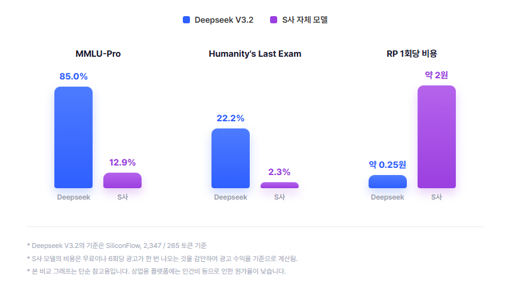

# Microzed

캐릭터 채팅 앱. BYOK(Bring Your Own Key) 방식으로, 사용자가 직접 발급받은 OpenAI 호환 API 키를 등록해서 사용합니다. 모든 데이터(플롯, 캐릭터, 대화, 로어북, API 키)는 로컬 기기에만 저장되고 별도 서버로 전송되지 않습니다.

## BYOK가 사실은 이득인 이유



## 주요 기능

- 플롯/캐릭터 제작, 인트로(첫 상황) 여러 버전 작성
- 로어북(세계관/설정) 작성 및 플롯 연결 — 키워드가 언급되면 AI에게 자동 전달
- OpenAI 호환 API를 이용한 실시간 스트리밍 채팅 (재시도, AI 수정, 직접 수정, 이전/다음 답변 넘기기)
- AI 프리셋 관리 (Base URL, 모델명, Temperature, Top K, Max Tokens, Context Length, 추가 시스템 프롬프트)
- 토큰 사용량/비용 내역 (엔드포인트가 알려주는 경우)

## 요구 사항

- [Flutter SDK](https://docs.flutter.dev/get-started/install) (stable 채널)
- Windows에서 빌드하려면 Visual Studio 2022 (Desktop development with C++ 워크로드)
- 사용할 OpenAI 호환 엔드포인트의 API 키 (OpenAI, OpenRouter, Anthropic 호환 게이트웨이, 로컬 서버 등)

## 설치 및 실행

```bash
# 1. 저장소를 내려받은 뒤 의존성 설치
flutter pub get

# 2. 코드 생성(Drift DB 등)이 필요하면 실행
dart run build_runner build

# 3. 실행 (Windows 데스크톱 기준)
flutter run -d windows
```

다른 플랫폼(Android/iOS/macOS/Linux)에서도 `flutter run -d <device>`로 실행할 수 있지만, 개발/테스트는 Windows 데스크톱을 기준으로 진행했습니다.

### 배포용 빌드

```bash
flutter build windows --release
```

## AI 프리셋 설정 방법

1. 마이페이지 → **AI 프리셋 설정** → **프리셋 추가**
2. Base URL(예: `https://api.openai.com/v1`, `https://openrouter.ai/api/v1`), 모델명, API 키를 입력
3. 필요하면 고급 설정(Temperature/Top K/Max Tokens/Context Length/추가 시스템 프롬프트) 조정
4. 채팅 화면 상단의 프리셋 선택 버튼에서 방금 만든 프리셋을 선택

API 키는 DB에 평문으로 저장되지 않습니다. Windows에서는 Win32 DPAPI로 암호화해서 앱 전용 저장 공간(`getApplicationSupportDirectory()`, 프로젝트 폴더 바깥)에 보관하고, DB에는 참조 키만 남습니다. 즉 이 저장소를 그대로 커밋/배포해도 API 키가 함께 유출되지 않습니다.

## 데이터 저장 위치

플롯/캐릭터/대화/로어북 등 모든 데이터는 로컬 SQLite(Drift) DB로 저장되며, 앱 전용 저장 공간(플랫폼별 application support 디렉터리)에 위치합니다. 저장소(git) 안에는 어떤 사용자 데이터나 API 키도 포함되지 않습니다.
