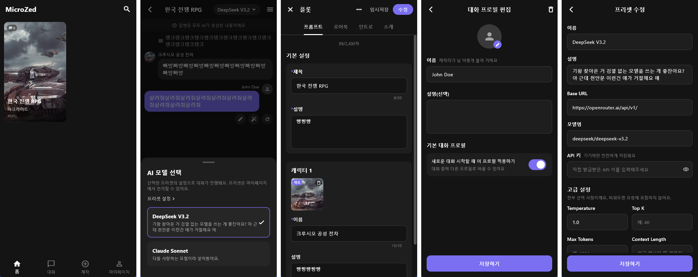

# Microzed



캐릭터 채팅 앱. BYOK(Bring Your Own Key) 방식으로, 사용자가 직접 발급받은 OpenAI 호환 API 키를 등록해서 사용합니다. 모든 데이터(플롯, 캐릭터, 대화, 로어북, API 키)는 로컬 기기에만 저장되고 별도 서버로 전송되지 않습니다. Windows 데스크톱과 Android를 모두 지원합니다.

## 주요 기능

- 플롯/캐릭터 제작, 인트로(첫 상황) 여러 버전 작성
- 플롯 전용 대화 프로필: 플롯마다 전용 유저 페르소나(이름/이미지/짧은 소개/설명)를 개수 제한 없이 만들 수 있고, 새 채팅을 시작할 때 스와이프 카드로 먼저 고르거나 전체 프로필 목록으로 전환해서 고를 수 있음
- `{{char}}`(캐릭터 소개글 안에서 자기 이름으로 치환) / `{{user}}`(대화 프로필 이름으로 실시간 치환) 매크로 지원
- 로어북(세계관/설정) 작성 및 플롯 연결 — 키워드가 언급되면 AI에게 자동 전달
- OpenAI 호환 API를 이용한 실시간 스트리밍 채팅
  - 재시도, AI 수정, 직접 수정 (재시도 중에는 이전 답변이 미리 감춰짐)
  - 이전/다음 답변 버튼 또는 답변 말풍선을 좌우로 드래그해서 버전 넘기기(오른쪽 끝에서 더 드래그하면 새로 생성)
  - 번개 버튼으로 AI가 다음에 보낼 만한 대화 후보 3개를 추천
  - Reasoning effort(끔/낮음/보통/높음) 설정 — 지원하는 원격 모델에는 `reasoning_effort`로 그대로 전달되고, 로컬 모델은 사고(thinking) 모드가 켜지며 답변 전에 "생각하는 중..." 실시간 표시
- 기기 내장 로컬 LLM (llama.cpp 기반, 완전 오프라인): 마이페이지 → 로컬 LLM에서 추천 모델(Huihui Gemma 4 / Qwen3.5 Abliterated 시리즈)을 원탭으로 받거나 직접 가진 GGUF 파일을 가져와서 로드/언로드. 기존 AI 프리셋과 동일하게 채팅에서 바로 선택 가능
- 스냅샷: 지금까지의 장면을 AI가 요약해서 이미지를 생성해 채팅에 삽입 (OpenRouter/AtlasCloud 중 선택, 마이페이지 → 스냅샷 설정)
- AI 프리셋 관리 (Base URL, 모델명, Temperature, Top K, Max Tokens, Context Length, 추가 시스템 프롬프트, Reasoning effort)
- 토큰 사용량/비용 내역 (엔드포인트가 알려주는 경우)
- SillyTavern 호환 카드 저장/불러오기
- 플롯 전용 형식(.mzplot) 내보내기/불러오기 — 이미지를 포함해 플롯 하나의 모든 데이터(대화 기록 제외)를 손실 없이 내보내고, 기존 데이터를 지우지 않고 새 플롯으로 병합해서 불러옴
- 전체 데이터 백업/복원(.mzbackup), 환경설정에서 전체 초기화(공장 초기화)
- 환경설정에서 인트로/스냅샷 이미지 표시 방식(정사각형/가로 꽉 채우기) 선택
- 여러 언어 지원 (한국어, 영어, 일본어 내장, 나머지는 Pull Request 환영)

## 요구 사항

- [Flutter SDK](https://docs.flutter.dev/get-started/install) (stable 채널)
- Windows에서 빌드하려면 Visual Studio 2022 (Desktop development with C++ 워크로드)
- Android에서 빌드하려면 Android SDK(Android Studio 설치 권장)
- 사용할 OpenAI 호환 엔드포인트의 API 키 (OpenAI, OpenRouter, Anthropic 호환 게이트웨이, 로컬 서버 등)
- (선택) 스냅샷 기능을 쓰려면 OpenRouter 또는 AtlasCloud의 이미지 생성 API 키

## 차라리 광고 보는게 더 낫지 않냐고요?


**아닙니다.**

## 설치 및 실행

```bash
# 1. 저장소를 내려받은 뒤 의존성 설치
flutter pub get

# 2. 코드 생성(Drift DB 등)이 필요하면 실행
dart run build_runner build

# 3. 실행 (Windows 데스크톱 기준)
flutter run -d windows
```

다른 플랫폼(Android/iOS/macOS/Linux)에서도 `flutter run -d <device>`로 실행할 수 있습니다. 개발/테스트는 Windows 데스크톱과 Android를 기준으로 진행했습니다.

### 배포용 빌드

```bash
# Windows
flutter build windows --release

# Android
flutter build apk --release
```

## AI 프리셋 설정 방법

1. 마이페이지 → **AI 프리셋 설정** → **프리셋 추가**
2. Base URL(예: `https://api.openai.com/v1`, `https://openrouter.ai/api/v1`), 모델명, API 키를 입력
3. 필요하면 고급 설정(Temperature/Top K/Max Tokens/Context Length/추가 시스템 프롬프트) 조정
4. 채팅 화면 상단의 프리셋 선택 버튼에서 방금 만든 프리셋을 선택

API 키는 DB에 평문으로 저장되지 않습니다. Windows에서는 Win32 DPAPI로 암호화해서 앱 전용 저장 공간(`getApplicationSupportDirectory()`, 프로젝트 폴더 바깥)에 보관하고, DB에는 참조 키만 남습니다. 다른 플랫폼(Android 등)에서는 OS가 다른 앱으로부터 격리해주는 앱 전용 저장 공간에 보관합니다. 즉 이 저장소를 그대로 커밋/배포해도 API 키가 함께 유출되지 않습니다.

## 스냅샷(장면 이미지 생성) 설정 방법

1. 마이페이지 → **스냅샷 설정**
2. 이미지 생성 엔드포인트로 OpenRouter 또는 AtlasCloud 중 선택
3. 해당 엔드포인트의 API 키와 이미지 모델명을 입력 (기본값: OpenRouter는 `google/gemini-2.5-flash-image`, AtlasCloud는 `seedream-3.0`)
4. 채팅 화면에서 AI 답변 아래 카메라 아이콘을 누르면, 지금까지의 장면을 AI가 한 문단으로 요약해서 설정한 엔드포인트로 이미지를 생성하고 채팅에 삽입합니다.

## 로컬 LLM(오프라인 모델) 사용 방법

인터넷/API 키 없이 기기에서 직접 모델을 돌릴 수 있습니다.

1. 마이페이지 → **로컬 LLM**
2. 추천 모델(Huihui Gemma 4 E2B/E4B, Qwen3.5 4B — 전부 abliterated/검열 완화 버전) 중 하나를 골라 다운로드하거나, 이미 가진 GGUF 파일을 "GGUF 파일 선택"으로 가져옵니다. 모델은 보통 2~5GB로 크니 저장 공간과 다운로드 환경을 확인하세요.
3. 로드가 끝나면 자동으로 AI 프리셋이 만들어져서, 채팅 화면의 모델 선택에서 원격 프리셋과 똑같이 고를 수 있습니다.
4. Reasoning effort를 켜면(프리셋 편집 화면) 사고 모드가 지원되는 모델은 답변 전에 미리 생각하는 과정을 거칩니다.

기기 성능에 따라 응답 속도가 원격 API보다 느릴 수 있고, 첫 다운로드 이후에는 완전히 오프라인으로 동작합니다.

## 플롯 전용 대화 프로필

플롯마다 그 플롯에서만 쓸 유저 페르소나를 여러 개 만들어 둘 수 있습니다.

1. 플롯 편집 → **프롬프트** 탭 맨 아래 "플레이하는 유저가 사용할 대화 프로필" 섹션에서 추가(이름/이미지/짧은 소개/설명, 개수 제한 없음)
2. 캐릭터 상세 화면에서 "이어서 대화하기"로 그 플롯의 새 채팅을 시작하면, 전용 프로필이 하나라도 있을 때 스와이프 가능한 카드 화면이 먼저 뜹니다. 목록 아이콘을 누르면 이 플롯 전용 프로필 + 마이페이지의 전역 프로필을 합친 목록으로 전환됩니다.
3. "플레이하는 유저 이름 사용하기"를 체크하면 그 프로필의 이름이 마이페이지 기본 프로필 이름과 항상 동기화됩니다.

## 데이터 내보내기/불러오기

- **SillyTavern 카드**: 대표 캐릭터 1명 + 대표 이미지 1장 기준의 표준 호환 포맷. 다른 SillyTavern 계열 앱과 주고받을 때 사용합니다.
- **전용 형식(.mzplot)**: 플롯 편집 → `⋮` 메뉴 → "전용 형식으로 내보내기". 캐릭터 여러 명, 이미지, 인트로 여러 버전, 플롯 전용 프로필, 연결된 로어북까지 이미지를 포함해 그대로 내보냅니다(대화 기록은 제외). 제작 탭의 "가져오기"에서 다시 불러올 수 있으며, 기존 데이터를 지우지 않고 새 플롯으로 추가됩니다.
- **전체 백업(.mzbackup)**: 마이페이지 → "전체 저장/전체 불러오기". API 키를 포함해 기기의 모든 데이터를 통째로 백업/복원합니다(불러오기는 기존 데이터를 전부 대체함).
- **전체 초기화**: 마이페이지 → 환경설정 맨 아래 위험 구역. 다운로드해둔 로컬 모델 파일은 남기고 나머지 모든 데이터를 앱 첫 설치 상태로 되돌립니다.

## 데이터 저장 위치

플롯/캐릭터/대화/로어북 등 모든 데이터는 로컬 SQLite(Drift) DB로 저장되며, 앱 전용 저장 공간(플랫폼별 application support 디렉터리)에 위치합니다. 저장소(git) 안에는 어떤 사용자 데이터나 API 키도 포함되지 않습니다.

자세한 내용은 [개인정보처리방침](./PrivacyPolicy.md)을 참고하세요.
